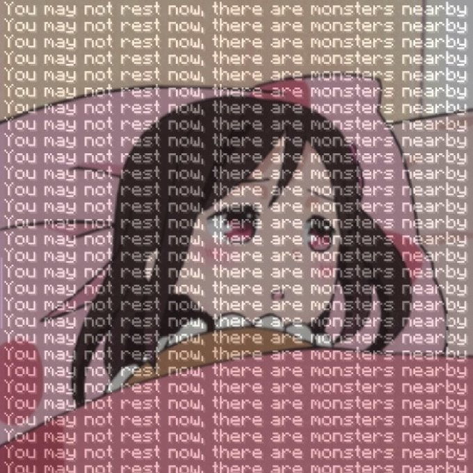

currently it is 04:34


<center>
now it is 04:35</center>
<p align="right">
now its 04:36
</p>


<span style="background:rgba(240, 200, 0, 0.2)">hello  aa woarlda aaaaaaaaa<p align="right"></p></span>
<span style="background:#9254de"><font color="#002060">a</font></span>


[[2024-11-07-1_lets-try-this-again|test]]


1
2


3  


4  

now ill use backslashes for newlines :))))) i love markdown
hi
\
\
\
hi after 3 backslashes
\
\
\
\
\
\
like 6 more wooo


```javascript
const blah = "hello"
return blah
```

```
const blah = "hello"
return blah
```
`hi` `const`

<span class="hover" title="test">hello world 2</span>

this has a footnote! [^1]

abcdedffg [^2]

this 
But I must explain to you how all this mistaken idea of reprobating pleasure and extolling pain arose. To do so, I will give you a complete account of the system, and expound the actual teachings of the great explorer of the truth, the master-builder of human happiness. No one rejects, dislikes or avoids pleasure itself, because it is pleasure, but because those who do not know how to pursue pleasure rationally encounter consequences that are extremely painful. Nor again is there anyone who loves or pursues or desires to obtain pain of itself, because it is pain, but occasionally circumstances occur in which toil and pain can procure him some great pleasure. To take a trivial example, which of us ever undertakes laborious physical exercise, except to obtain some advantage from it? But who has any right to find fault with a man who chooses to enjoy a pleasure that has no annoying consequences, or one who avoids a pain that produces no resultant pleasure?
But I must explain to you how all this mistaken idea of reprobating pleasure and extolling pain arose. To do so, I will give you a complete account of the system, and expound the actual teachings of the great explorer of the truth, the master-builder of human happiness. No one rejects, dislikes or avoids pleasure itself, because it is pleasure, but because those who do not know how to pursue pleasure rationally encounter consequences that are extremely painful. Nor again is there anyone who loves or pursues or desires to obtain pain of itself, because it is pain, but occasionally circumstances occur in which toil and pain can procure him some great pleasure. To take a trivial example, which of us ever undertakes laborious physical exercise, except to obtain some advantage from it? But who has any right to find fault with a man who chooses to enjoy a pleasure that has no annoying consequences, or one who avoids a pain that produces no resultant pleasure?
But I must explain to you how all this mistaken idea of reprobating pleasure and extolling pain arose. To do so, I will give you a complete account of the system, and expound the actual teachings of the great explorer of the truth, the master-builder of human happiness. No one rejects, dislikes or avoids pleasure itself, because it is pleasure, but because those who do not know how to pursue pleasure rationally encounter consequences that are extremely painful. Nor again is there anyone who loves or pursues or desires to obtain pain of itself, because it is pain, but occasionally circumstances occur in which toil and pain can procure him some great pleasure. To take a trivial example, which of us ever undertakes laborious physical exercise, except to obtain some advantage from it? But who has any right to find fault with a man who chooses to enjoy a pleasure that has no annoying consequences, or one who avoids a pain that produces no resultant pleasure?
But I must explain to you how all this mistaken idea of reprobating pleasure and extolling pain arose. To do so, I will give you a complete account of the system, and expound the actual teachings of the great explorer of the truth, the master-builder of human happiness. No one rejects, dislikes or avoids pleasure itself, because it is pleasure, but because those who do not know how to pursue pleasure rationally encounter consequences that are extremely painful. Nor again is there anyone who loves or pursues or desires to obtain pain of itself, because it is pain, but occasionally circumstances occur in which toil and pain can procure him some great pleasure. To take a trivial example, which of us ever undertakes laborious physical exercise, except to obtain some advantage from it? But who has any right to find fault with a man who chooses to enjoy a pleasure that has no annoying consequences, or one who avoids a pain that produces no resultant pleasure?
But I must explain to you how all this mistaken idea of reprobating pleasure and extolling pain arose. To do so, I will give you a complete account of the system, and expound the actual teachings of the great explorer of the truth, the master-builder of human happiness. No one rejects, dislikes or avoids pleasure itself, because it is pleasure, but because those who do not know how to pursue pleasure rationally encounter consequences that are extremely painful. Nor again is there anyone who loves or pursues or desires to obtain pain of itself, because it is pain, but occasionally circumstances occur in which toil and pain can procure him some great pleasure. To take a trivial example, which of us ever undertakes laborious physical exercise, except to obtain some advantage from it? But who has any right to find fault with a man who chooses to enjoy a pleasure that has no annoying consequences, or one who avoids a pain that produces no resultant pleasure?
But I must explain to you how all this mistaken idea of reprobating pleasure and extolling pain arose. To do so, I will give you a complete account of the system, and expound the actual teachings of the great explorer of the truth, the master-builder of human happiness. No one rejects, dislikes or avoids pleasure itself, because it is pleasure, but because those who do not know how to pursue pleasure rationally encounter consequences that are extremely painful. Nor again is there anyone who loves or pursues or desires to obtain pain of itself, because it is pain, but occasionally circumstances occur in which toil and pain can procure him some great pleasure. To take a trivial example, which of us ever undertakes laborious physical exercise, except to obtain some advantage from it? But who has any right to find fault with a man who chooses to enjoy a pleasure that has no annoying consequences, or one who avoids a pain that produces no resultant pleasure?
But I must explain to you how all this mistaken idea of reprobating pleasure and extolling pain arose. To do so, I will give you a complete account of the system, and expound the actual teachings of the great explorer of the truth, the master-builder of human happiness. No one rejects, dislikes or avoids pleasure itself, because it is pleasure, but because those who do not know how to pursue pleasure rationally encounter consequences that are extremely painful. Nor again is there anyone who loves or pursues or desires to obtain pain of itself, because it is pain, but occasionally circumstances occur in which toil and pain can procure him some great pleasure. To take a trivial example, which of us ever undertakes laborious physical exercise, except to obtain some advantage from it? But who has any right to find fault with a man who chooses to enjoy a pleasure that has no annoying consequences, or one who avoids a pain that produces no resultant pleasure?[^3]
more
![[Attachments/12799_macroquadthing_15.17 1.mp4]]



[^1]: blah blah
[^2]: blah blah foo bar
[^3]: footnote :D